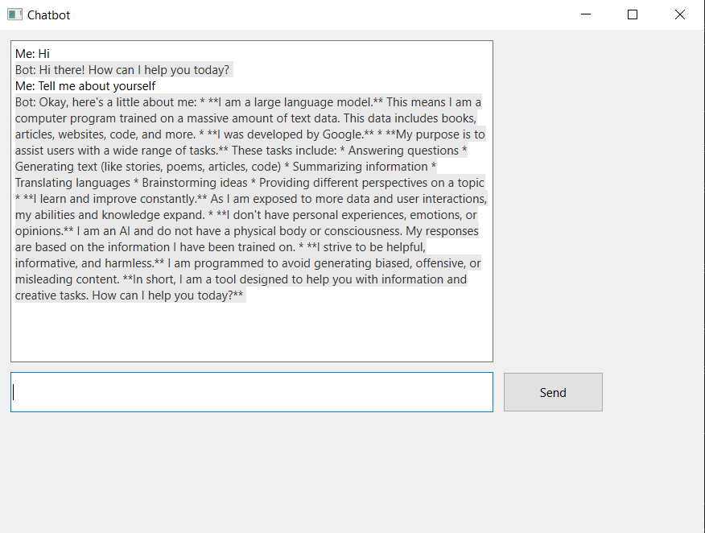

# Chatbot_gpt

A simple Python chatbot using Google Gemini API (via `google-genai`).

## Features

- Connects to Google Gemini (`gemini-2.0-flash`) for conversational AI.
- Easily extendable for your own projects.

## Screenshot




## Setup

### 1. Clone the repository

```sh
git clone <your-repo-url>
cd Chatbot_gpt
```

### 2. Install dependencies

```sh
pip install google-generativeai
```

### 3. Set up your API key

**Recommended:**  
Store your API key in an environment variable for security.

```sh
# On Windows PowerShell
$env:GOOGLE_API_KEY="your-gemini-api-key"
```

Or, you can use a `credential.py` file:

```python
# credential.py
your_api_key = "your-gemini-api-key"
```

And import it in `backend.py`:

```python
from credential import your_api_key
self.client = genai.Client(api_key=your_api_key)
```

### 4. Run the chatbot

```sh
python backend.py
```

## Usage

Edit `backend.py` to change the prompt or integrate with your own application.

## Example

```
Hi
# (Gemini's response)
```

## Security

**Never commit your API key to public repositories.**  
Use environment variables or a local, untracked `credential.py` file.

## License

MIT License